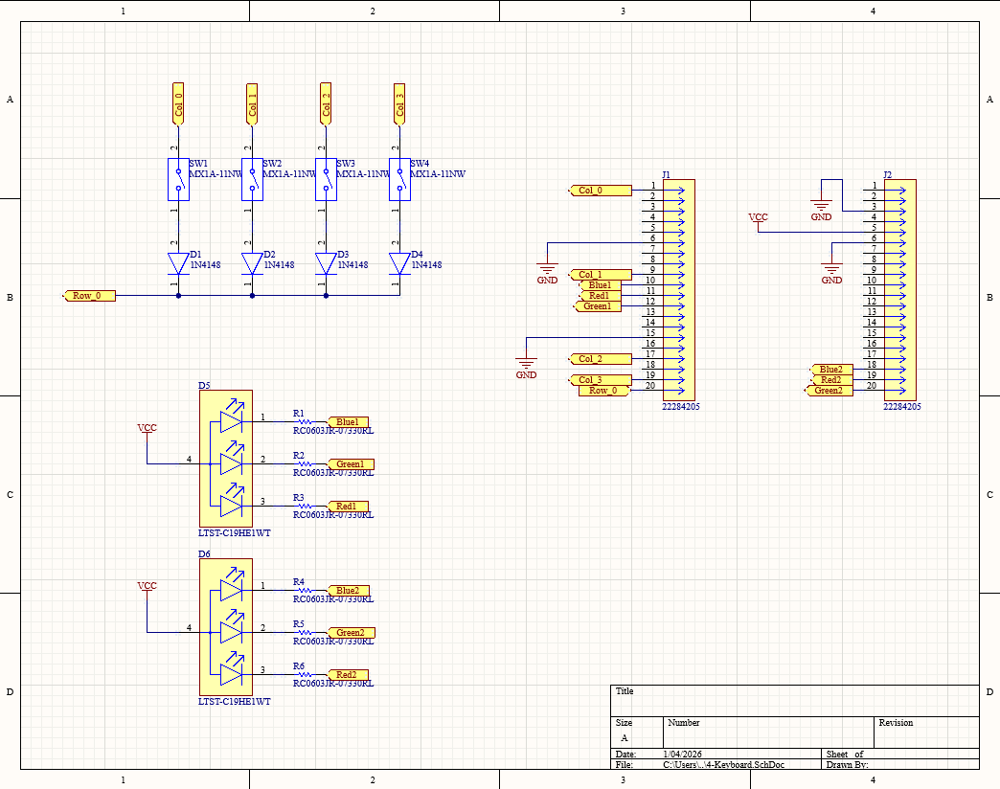
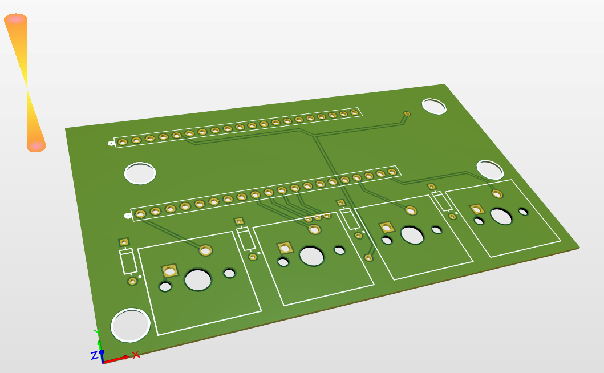
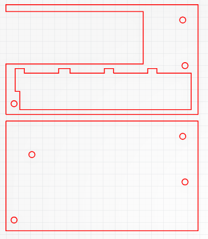
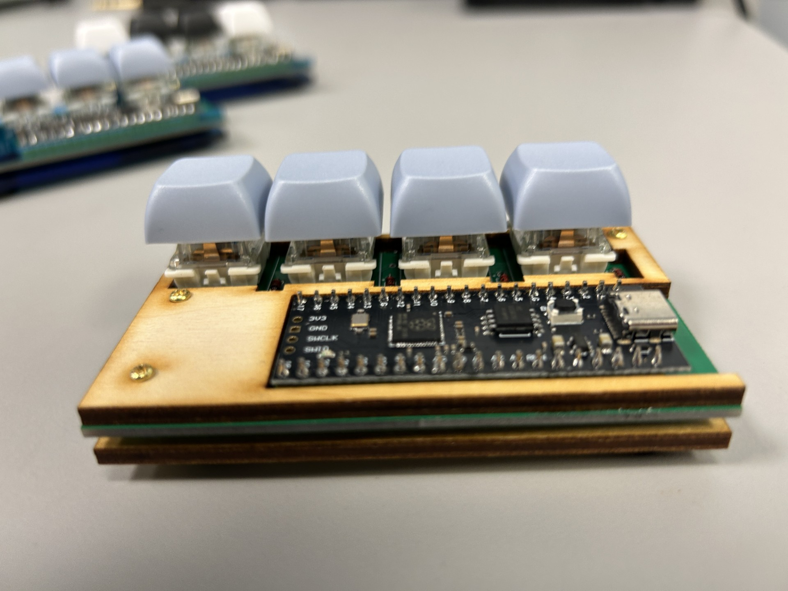
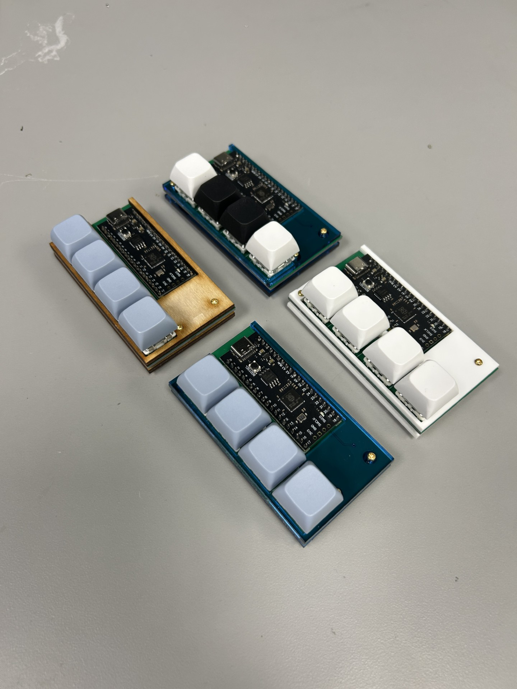
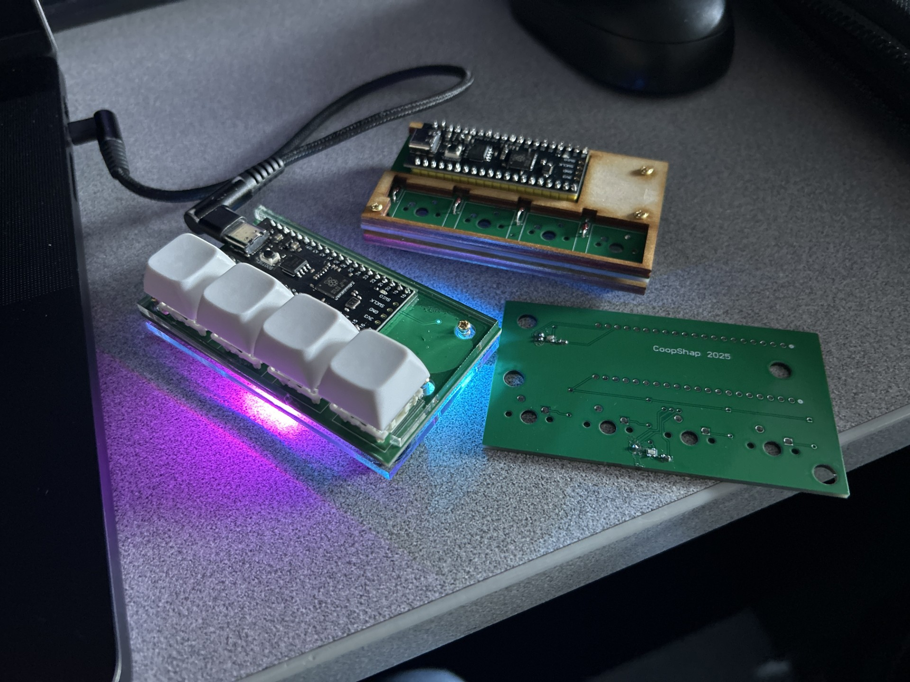
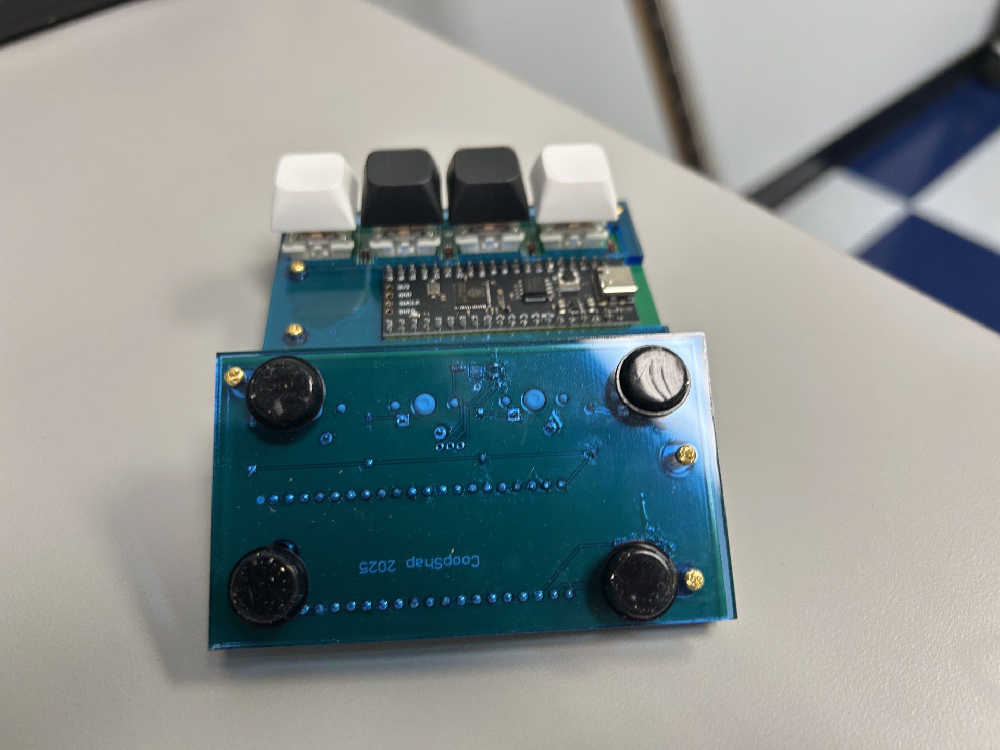

# A Custom 4-Key Backlit Macropad
Designed for a university event where students come pick keyboard parts for me to assemble and program their own keyboard. Emphasis placed on the customization of case color, switch types, keycaps, and key functions.

## Schematic Capture
The board was designed in Altium to work with a ZDE RP2040 devboard as the microcontroller. Budget was limited for the event and Amazon was the only approved vendor, so some compromises were made in part selection. The footprint for the devboard was custom-made from two spaced 20-pin 0.1" headers (I would have made a symbol for it, but I have no intention of using this board again). Standard CherryMX keyswitches were used with through-hole diodes (for aesthetics) and backlighting was made from non-addressable SMD RGB LEDs. The schematic captuer can be seen below:

## PCB Layout and Case
Here are some photos of the PCB layout and 3D model. Also included is the SVG for the case, which was laser-cut out of various materials.

## Assembly
Below are the photos of the finished product. Around 10 students attended the event and walked away with a fun, personalized keyboard/macropad. Some even opted to solder the through-hole components themselves, so I gave a few soldering lessons too. Overall, I like the way the boards turned out. The only issues with the design were the LEDs being too dim, which was easily fixed by lowering the resistor values, and the microcontroller board being a bit too far from the edge of the pcb (no dimensions/datasheet were provided for the board, so it was just an eyeball estimate). I also wrote some custom firmware for the boards using QMK, which is also attached in this repo. Enjoy!

	

